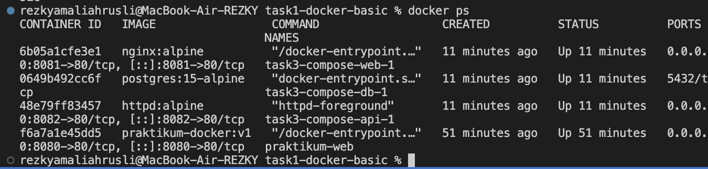
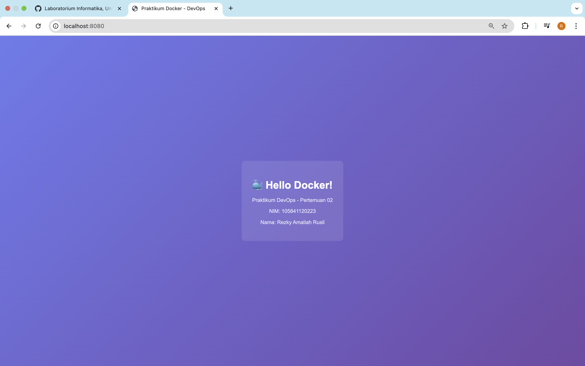
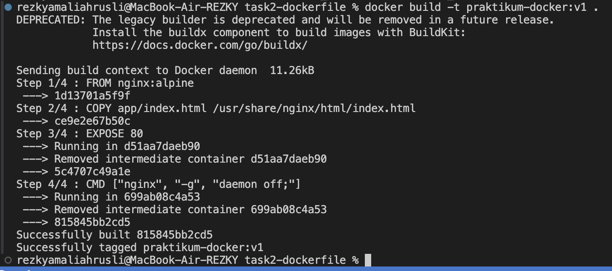
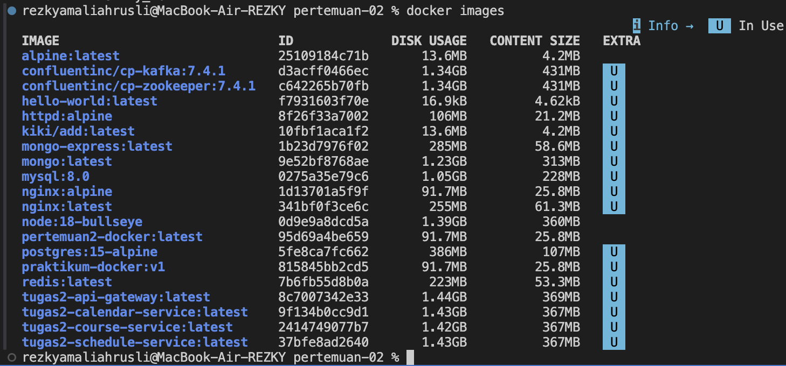
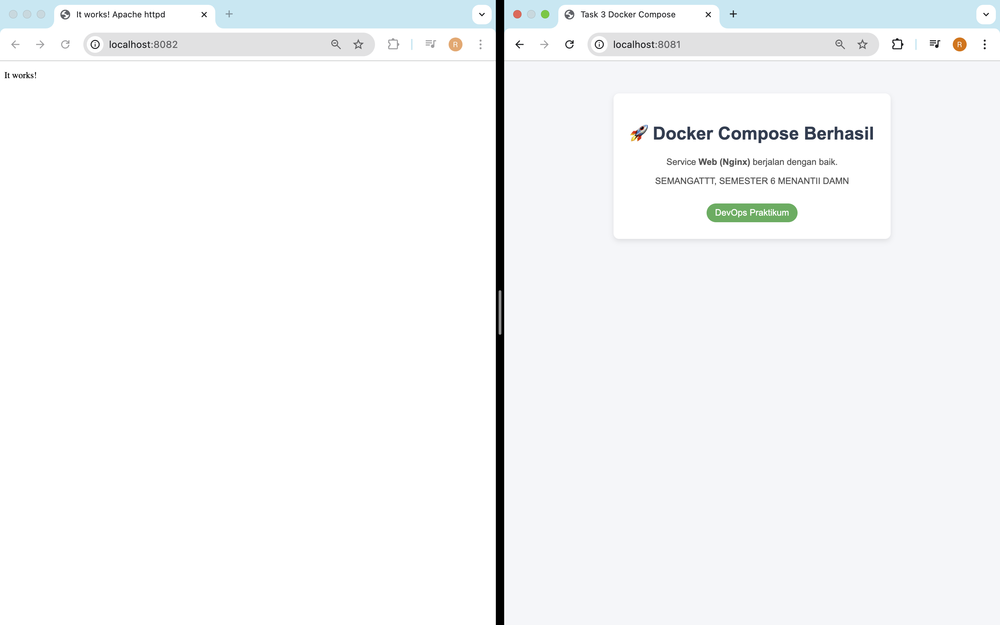

# 🐳 Laporan Praktikum Pertemuan 02
## Docker Fundamentals

---

## 👤 Identitas Mahasiswa

| Item | Keterangan |
|------|------------|
| **Nama** | REZKY AMALIAH RUSLI |
| **NIM** | 105841120223 |
| **Kelas** | 5B-RPL |
| **Tanggal** | Rabu, 25 Februari 2026 |

---

## 📚 Pemahaman Docker

### Apa itu Docker?

Docker adalah platform yang memungkinkan kita menjalankan aplikasi di dalam container. Container adalah paket yang berisi aplikasi beserta semua dependency-nya (library, runtime, konfigurasi) sehingga aplikasi bisa berjalan konsisten di berbagai environment (laptop, server, cloud) tanpa perlu mengatur ulang konfigurasi satu per satu.

Dengan containerization, satu host bisa menjalankan banyak container yang saling terisolasi. Hal ini mempermudah deployment, scaling, dan maintenance aplikasi.

### Komponen Utama Docker

1. **Docker Image**  
	 Image adalah blueprint (template) read-only yang berisi file system, aplikasi, dan dependency. Dari image inilah container dibuat. Image bisa dibuat sendiri (melalui Dockerfile) atau di-pull dari registry seperti Docker Hub.

2. **Docker Container**  
	 Container adalah instance yang berjalan dari sebuah image. Container memiliki file system sendiri, proses sendiri, dan bisa dieksekusi, dihentikan, dihapus, dan dijalankan ulang. Container bersifat ringan karena berbagi kernel dengan host.

3. **Docker Registry**  
	 Registry adalah tempat penyimpanan image (publik atau privat). Contoh paling umum adalah Docker Hub. Kita bisa `docker pull` untuk mengambil image dari registry dan `docker push` untuk mengirim image yang kita buat.

### Perbedaan Docker vs Virtual Machine

- **Arsitektur**: VM menjalankan OS lengkap di atas hypervisor (setiap VM punya kernel sendiri), sedangkan container berbagi kernel dari host dan hanya membawa filesystem + dependency aplikasi.
- **Resource**: VM lebih berat (butuh RAM dan storage lebih besar), container jauh lebih ringan dan cepat start/stop.
- **Use case**: VM cocok untuk isolasi level OS, container lebih cocok untuk packaging dan menjalankan aplikasi secara konsisten di berbagai environment.

---

## 🔧 Praktik Docker Commands (Task 1: Docker Basic)

## 📄 Dockerfile (Task 2: Custom Image)
### Penjelasan Dockerfile

Contoh pola penjelasan:

- `FROM ...`  
	Menentukan base image yang digunakan sebagai dasar container.

- `WORKDIR /app`  
	Menentukan direktori kerja di dalam container.

- `COPY ...`  
	Menyalin file dari host ke dalam container.

- `RUN ...`  
	Menjalankan perintah saat build image (misalnya instal dependency).

- `EXPOSE ...`  
	Mendokumentasikan port yang digunakan aplikasi di dalam container.

- `CMD [...]` / `ENTRYPOINT`  
	Menentukan perintah utama yang dijalankan saat container start.

Silakan lengkapi penjelasan setiap baris Dockerfile sesuai file yang dibuat.

---

## 🐙 Docker Compose (Task 3: Multi-container)

### Isi `docker-compose.yml`

Berikut contoh struktur yang digunakan pada folder `task3-compose/`:

```yaml
version: '3.8'

services:
	web:
		image: nginx:alpine
		ports:
			- "8081:80"
		volumes:
			- ./app:/usr/share/nginx/html:ro
		depends_on:
			- api
		networks:
			- praktikum-net

	api:
		image: httpd:alpine
		ports:
			- "8082:80"
		networks:
			- praktikum-net

	db:
		image: postgres:15-alpine
		environment:
			POSTGRES_USER: praktikum
			POSTGRES_PASSWORD: devops123
			POSTGRES_DB: praktikum_db
		volumes:
			- db_data:/var/lib/postgresql/data
		networks:
			- praktikum-net

networks:
	praktikum-net:
		driver: bridge

volumes:
	db_data:
```

### Penjelasan Struktur Docker Compose

- **Service `web`**  
	Menggunakan image `nginx:alpine`, memetakan port host `8081` ke port `80` di container, dan menggunakan volume `./app` agar file HTML lokal bisa di-serve oleh Nginx. Service ini bergantung pada service `api` dan berada pada network `praktikum-net`.

- **Service `api`**  
	Menggunakan image `httpd:alpine` (Apache HTTP Server) dengan mapping port `8082:80` sehingga dapat diakses melalui `http://localhost:8082`.

- **Service `db`**  
	Menggunakan image `postgres:15-alpine` dengan environment variable untuk user, password, dan nama database. Data disimpan di volume `db_data` agar tetap persisten meskipun container dihapus.

- **Network `praktikum-net`**  
	Jaringan bridge yang menghubungkan ketiga service sehingga mereka dapat saling berkomunikasi menggunakan nama service (`web`, `api`, `db`).

- **Volume `db_data`**  
	Volume khusus untuk menyimpan data Postgres.

### Perintah Menjalankan Docker Compose

```bash
cd task3-compose
docker-compose up -d
```

Untuk menghentikan dan menghapus container-compose:

```bash
docker-compose down
```

### Output `docker-compose up`

```text
<ISI DENGAN OUTPUT PENTING DARI `docker-compose up` / `docker-compose ps`>
```

---

## 📸 Screenshots Bukti Praktikum

File screenshot disimpan di folder `sceenshots/`.

| No | Screenshot | Keterangan |
|----|------------|-----------|
| 1 |  | Container yang sedang berjalan (task1 / task3) |
| 2 |  | Halaman Nginx diakses dari browser |
| 3 |  | Proses `docker build` image kustom |
| 4 |  | Daftar Docker images kustom yang sudah dibuat |
| 5 |  | Output `docker-compose ps` |
| 6 |  | Services yang berjalan dengan Docker Compose |

---

## 💭 Refleksi & Kesimpulan

### Yang Dipelajari

Pada praktikum ini saya belajar konsep dasar Docker, cara menjalankan container sederhana menggunakan `docker run`, membuat image kustom dengan Dockerfile, serta mengelola beberapa service sekaligus menggunakan Docker Compose. Saya juga belajar menangani error umum seperti konflik port dan nama container yang sudah digunakan.

### Manfaat Docker dalam Pengembangan Software

Docker membantu developer menjalankan aplikasi dengan environment yang konsisten di berbagai mesin. Dengan container, setup environment menjadi lebih cepat, mudah direplikasi, dan meminimalkan masalah "works on my machine". Docker juga memudahkan proses deployment karena aplikasi dan dependensinya dikemas dalam satu paket image.

### Tantangan dan Solusi

Beberapa tantangan yang dihadapi antara lain:

- Konflik port yang sudah digunakan oleh container lain. Solusinya adalah menghentikan container lama atau mengganti mapping port host.
- Error saat menjalankan Docker Compose karena port yang sama digunakan oleh dua service. Solusinya adalah mengatur port yang berbeda untuk setiap service (`8081` untuk web dan `8082` untuk api).
- Menghafal perintah Docker yang cukup banyak. Solusinya adalah mencatat perintah penting di file `commands.md` dan sering berlatih.

---

## ✅ Checklist

- [x] Berhasil membuat Dockerfile yang valid
- [x] Berhasil build Docker image
- [x] Container berjalan dan aplikasi bisa diakses
- [x] Docker Compose berhasil dijalankan
- [x] Semua screenshot lengkap dan jelas
- [x] Penjelasan ditulis dengan bahasa sendiri (dapat disesuaikan kembali jika diperlukan)

---

*Laporan ini dibuat pada Rabu, 25 Februari 2026*

